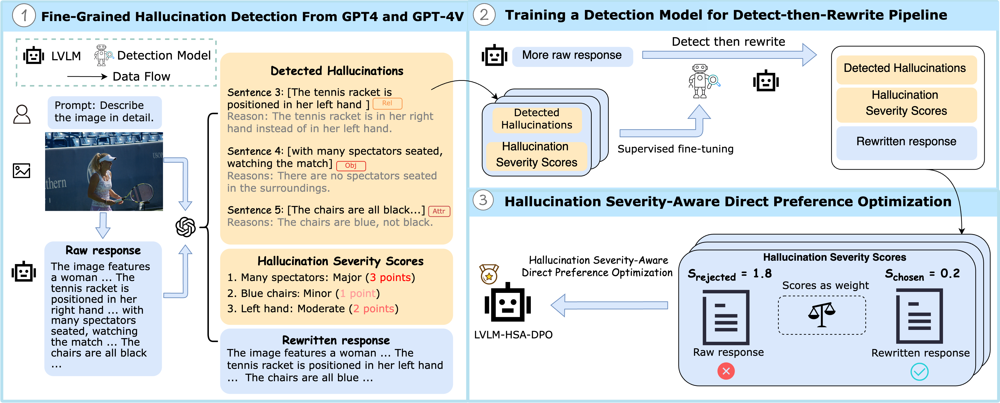

<!-- # magic-edit.github.io -->

<p align="center">
  <h2 align="center">[AAAI 2025] Detecting and Mitigating Hallucination in Large Vision Language Models via Fine-Grained AI Feedback
</h2>
  <p align="center">
    <a><strong>Wenyi Xiao<sup>1*</sup> , </strong></a>
    <a><strong>Ziwei Huang<sup>1*</sup> , </strong></a>
    <a><strong>Leilei Gan<sup>1†</sup> , </strong></a>
    <a><strong>Wanggui He<sup>2</sup>  </strong></a>
    <br>
    <a><strong>Haoyuan Li<sup>2</sup> ,  </strong></a>
    <a><strong>Zhelun Yu<sup>2</sup> , </strong></a>
    <a><strong>Fangxun Shu<sup>2</sup> ,  </strong></a>
    <a><strong>Hao Jiang<sup>2</sup> , </strong></a>
    <a><strong>Linchao Zhu<sup>1</sup>   </strong></a>
    <br>
    <sup>1</sup> Zhejiang University&nbsp;&nbsp;&nbsp;&nbsp;&nbsp;&nbsp;<sup>2</sup> Alibaba Group&nbsp;&nbsp;&nbsp;&nbsp;&nbsp;&nbsp
    <br>
    <sup>*</sup>Equal contribution &nbsp;&nbsp;&nbsp;&nbsp;&nbsp;&nbsp <sup>†</sup>Corresponding author
    </br>
    </br>
        <a href="https://arxiv.org/pdf/2404.14233">
        </a>
        <a href="https://huggingface.co/datasets/WenyiXiao/HSA-DPO">
        </a>
        <a href="https://modelscope.cn/models/xiaowenyi/HSA-DPO">
        </a>
        
  </p>
</p>


## Overview

This repository contains the official implementation of the paper "Detecting and Mitigating Hallucination in Large Vision Language Models via Fine-Grained AI Feedback".



## Table of Contents

- [Overview](#overview)
- [Installation](#installation)
- [Dataset](#dataset)
  - [Download Dataset](#download-dataset)
  - [Dataset Organization](#dataset-organization)
  - [Prepare Data for Training](#prepare-data-for-training)
- [Training](#training)
  - [Prerequisites](#prerequisites)
  - [Running Training](#running-training)
  - [Key Parameters](#key-parameters)
  - [Multi-GPU Training](#multi-gpu-training)
- [Evaluation](#evaluation)
  - [Download Model Weights](#download-model-weights)
  - [Run Inference](#run-inference)
- [Citation](#citation)
- [Acknowledgements](#acknowledgements)

## Installation

```bash
git clone https://github.com/Mr-Loevan/HSA-DPO.git
cd HSA-DPO

# Install HSA-DPO and dependencies
pip install -e .

# (Optional) Install flash-attention for faster training
pip install -e ".[flash-attn]"
```

## Dataset

### Download Dataset
```bash
pip install -U huggingface_hub

# Download all dataset files
huggingface-cli download --repo-type dataset WenyiXiao/HSA-DPO --local-dir ./datasets
```

### Dataset Organization

**For hallucination detection:** 
- Training data: `hsa_dpo_detection.jsonl`
- Images: From [Visual Genome](https://homes.cs.washington.edu/~ranjay/visualgenome/api.html)

**For hallucination mitigation (HSA-DPO training):** 
- Preference data: `hsa_dpo_preference_llava1dot5.jsonl` 
- Images: `hsa_dpo_imgs.tar.gz`

### Prepare Data for Training

```bash
# 1. Create data directories
mkdir -p hsa_dpo/data
mkdir -p hsa_dpo/data/image

# 2. Copy preference dataset
cp datasets/hsa_dpo_preference_llava1dot5.jsonl hsa_dpo/data/

# 3. Extract images
tar -xzf datasets/hsa_dpo_imgs.tar.gz -C hsa_dpo/data/image/

# 4. Verify data structure
ls hsa_dpo/data/
# Should show: hsa_dpo_preference_llava1dot5.jsonl

ls hsa_dpo/data/image/ | head -5
# Should show: 0.jpg, 1.jpg, 2.jpg, 3.jpg, 4.jpg ...
```

**Note:** The images are named with sequential IDs (0.jpg, 1.jpg, ...) corresponding to the `id` field in the JSONL file.

## Training

### Prerequisites

1. Install the HSA-DPO package:
```bash
pip install -e .
```

2. Prepare dataset following the instructions above (see [Dataset](#dataset) section)

3. Download the base LLaVA-v1.5 model:
```bash
# Download LLaVA-v1.5-13B model
huggingface-cli download liuhaotian/llava-v1.5-13b --local-dir ./models/llava-v1.5-13b

# The CLIP vision encoder will be auto-downloaded during training
```

### Running Training

We provide a training script for HSA-DPO with LLaVA-v1.5:

```bash
# Configure paths in hsa_dpo_train.sh
vim hsa_dpo_train.sh

# Update these paths according to your setup:
# DATA_PATH="./hsa_dpo/data/hsa_dpo_preference_llava1dot5.jsonl"
# IMAGE_FOLDER="./hsa_dpo/data/image"
# MODEL_PATH="path/to/llava-v1.5-13b"
# OUTPUT_DIR="./output/hsa_dpo_llava"

# Run training
bash hsa_dpo_train.sh
```

### Key Parameters

- `use_chosen_score`: Whether to use chosen scores in DPO loss (default: False)
- `use_rejected_score`: Whether to use rejected scores in DPO loss (default: True)
- `beta`: Temperature parameter for DPO loss (default: 0.1)
- `num_train_epochs`: Number of training epochs (default: 2)
- `per_device_train_batch_size`: Batch size per GPU (default: 8)
- `learning_rate`: Learning rate (default: 2e-6)

### Multi-GPU Training

The script supports multi-GPU training with DeepSpeed. Adjust `NUM_GPUS` in the script:

```bash
NUM_GPUS=2  # Use 2 GPUs
bash hsa_dpo_train.sh
```

## Evaluation

### Download Model Weights

```bash
pip install -U modelscope
modelscope download --model xiaowenyi/HSA-DPO --local-dir ./checkpoints
```

### Run Inference

We provide a simple inference script to test the model:

```bash
# Run inference (LLaVA should already be installed from Installation step)
python inference/inference_example.py \
    --model-base path/to/llava-v1.5-13b \
    --lora-path ./checkpoints/HSA-DPO_llava_v1.5-13B-lora \
    --image path/to/image.jpg \
    --prompt "Describe this image in detail."
```

## Citation

If you find this work useful, please cite our paper:

```bibtex
@article{xiao2025hsa_dpo,
  title     = {Detecting and Mitigating Hallucination in Large Vision Language Models 
               via Fine-Grained AI Feedback},
  author    = {Xiao, Wenyi and Huang, Ziwei and Gan, Leilei and He, Wanggui and 
               Li, Haoyuan and Yu, Zhelun and Shu, Fangxun and Jiang, Hao and 
               Zhu, Linchao},
  journal   = {Proceedings of the AAAI Conference on Artificial Intelligence},
  volume    = {39},
  number    = {24},
  pages     = {25543--25551},
  year      = {2025},
  month     = {Apr},
  url       = {https://ojs.aaai.org/index.php/AAAI/article/view/34744},
  doi       = {10.1609/aaai.v39i24.34744}
}
```